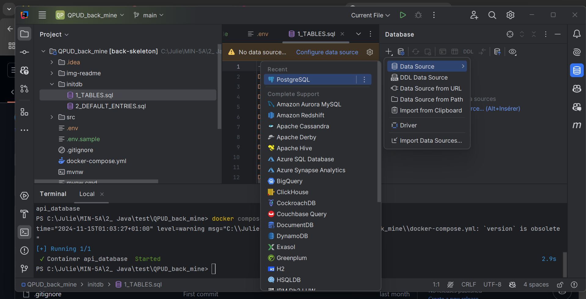
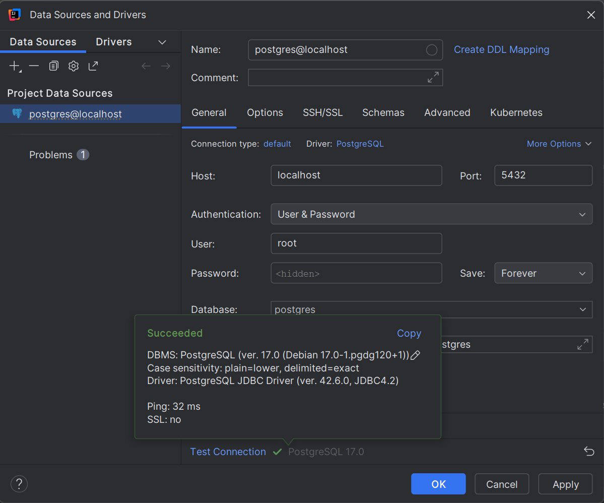
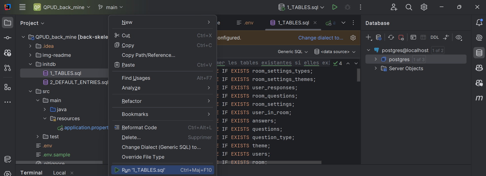
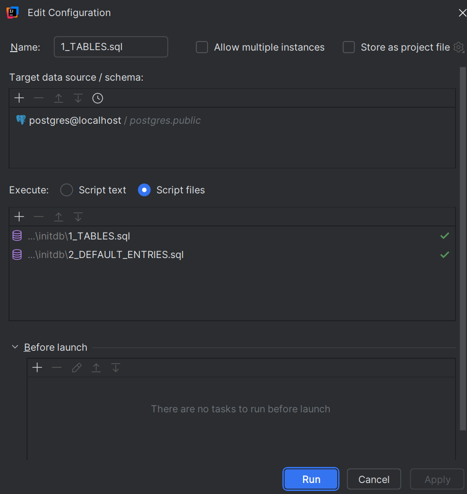
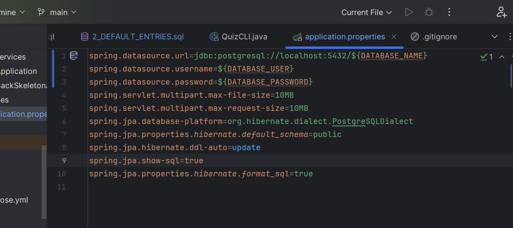

# Your backend API

## Set up 
1. Copie-colle le .env.sample en .env
2. Ajoute tes variable a toi
3. Fait un `docker-compose up`
4. Rajoute le pluggin : https://plugins.jetbrains.com/plugin/7861-envfile
5. 
6. 
7. 
8. Ajoute la BDD, c'est une postgres
   
   test la connection à ta BDD
   
9. Run la BDD et ajouter les infos
   
   
10. Modifier le application.properties dans les fichier ressources dans le main
   il faut remplacer les `${DATABASE_PASSWORD}`, `${DATABASE_USER}`, `${DATABASE_NAME}`, par vos valeurs à vous.
    
11. Vous pouvez tester le back directement en faisant run le cli, dans src/main/cli

